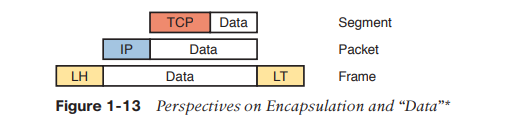

# TCP/IP 網路導論

* 1.1 [TCP/IP 網路模型](#1-1-tcpip-網路模型)
  * 1.1.1 [TCP/IP 的歷史](#1-11-tcpip-的歷史)
  * 1.1.2 [TCP/IP 概觀](#1-12-tcpip-概觀)
  * 1.1.3 [應用層(Application Layer)](#1-13-應用層application-layer)
  * 1.1.4 [TCP/IP 傳輸層(Transport Layer)](#1-14-tcpip-傳輸層transport-layer)
  * 1.1.5 [TCP/IP 網路層(Internet Layer)](#1-15-tcpip-網路層internet-layer)
  * 1.1.6 [TCP/IP 資料鏈結層 & 實體層 (Data Link & Physical Layer)](#1-16-tcpip-資料鏈結層--實體層-data-link--physical-layer)

* 1.2 [資料封裝術語 --- Encapsulation](#1-2-資料封裝術語)
  * 1.2.1 [TCP/IP 訊息的名稱](#1-21-tcpip-訊息的名稱)
  * 1.2.2 [OSI網路模型與專有名詞](#1-22-osi網路模型與專有名詞)

* [本章關鍵詞](#本章關鍵詞)

* [問答題](#問答題)

## 1-1 TCP/IP 網路模型

網路模型(networking model)，有時也稱網路架構(networking architecture)，指的是一套**文件**。
  * 這些文件定義網路中的每一件工作，包括通訊協定、實體需求(例如電流或電壓等)
  * 可以將這些文件想像成一個**建築藍圖**，大家只要按圖施工就不會有問題

  > 當然，你也可以自己寫一套網路模型，不過用大家都在用的會比較方便，設備的相容性也會比較好

### 1-1.1 TCP/IP 的歷史

最初，沒有甚麼網路協定，每家廠商各自有各自的協定，只支援自己生產的電腦。
  * 所以如果公司用了三家不同廠商的電腦，就要用不同的網路模型建立公司網路。

1970年代，由 ISO(International Organization for Standardization) 建立 OSI 模型，企圖標準化網路模型與協定。
  * 另外，美國國防部協助建立了開放、大眾化的網路模型，為 TCP/IP。

1990，TCP/IP 成為業界主流，不過仍與其他網路模型共存。

21世紀後，TCP/IP 佔據絕對主流，雖然私人網路模型依舊存在，但**主流仍是 TCP/IP**。

### 1-1.2 TCP/IP 概觀

協定範例：

| TCP/IP Layer | Protocol |
| ------------ | -------- |
| Application  | HTTP、POP3、SMTP、FTP、SSH、Telnet |
| Transport    | TCP、UDP |
| Internet     | IP、ICMP、ARP|
| Data Link & physical | Ethernet、Wi-Fi(802.11)、PPP |

### 1-1.3 應用層(Application Layer)

並非定義應用程式本身，而是定義應用程式所需的服務。

> 簡單來說，就是定義軟體和網路的溝通介面，例如 HTTP 定義瀏覽器如何下載網頁內容。

HTTP GET 步驟：

步驟一：client向server發送帶有HTTP標頭的訊息，這個標頭包含了GET要求，如果沒有指定文件，server會假設client要的是預設網頁

步驟二：server向client發送帶有HTTP標頭的訊息，這個標頭包含了200(return code)，代表「要求已完成」。除了return code，還有client要求文件的一部份內容

步驟三：server向client發送其他訊息(要求文件其他的部分)，但省略HTTP標頭。HTTP會將網頁內容拆成多份傳送，避免重複的HTTP標頭浪費空間

### 1-1.4 TCP/IP 傳輸層(Transport Layer)

這層最常見的兩個協定：
* **TCP**(Transmission Control Protocol)
* **UDP**(User Datagram Protocol)

傳輸層負責對應用層的協定提供服務，底下以TCP的錯誤修復為例：

> 假如client與server在通訊過程中，HTTP的請求/回應遺失了該怎麼辦？

TCP錯誤修復：acknowledgment 機制

在剛剛HTTP GET的情境中，加入 TCP 標頭做討論:

* 每個 TCP 標頭會有序號(SEQ)，如果 server 回傳了三個 TCP+HTTP 回應，但 client 只收到了1、3，client 就會認為 2 遺失了，TCP 會讓 client 傳訊息給 server，要求重新傳送 2。

**補充：網路模型的互動模式**

* 鄰接層互動(adjacent-layer interaction)：同台電腦鄰接層共同運作。例如上層(HTTP)想修復錯誤，就會讓下層(TCP)執行這項任務

* 同層互動(same-layer interaction)：不同電腦間的同層互動，使用標頭存放要溝通的資訊。例如TCP中的SEQ

### 1-1.5 TCP/IP 網路層(Internet Layer)

此層的重要協定：**IP**。

IP 可以理解為房子的住址，透過路由就可以將IP封包傳到正確的目的地。

### 1-1.6 TCP/IP 資料鏈結層 & 實體層 (Data Link & Physical Layer)

資料鏈結層和實體層，兩者共同定義了傳遞資料時跨越的「實體」網路所需的協定、硬體。

簡單來說，兩者的差別在：實體傳輸資料 vs 控制實體媒介

資料鏈結層：提供服務給網路層，當主機(or 路由器)的 IP 封包要傳送到下一台主機時，會需要鏈結層的資訊，以下以一個 LAN 中傳遞的 IP 封包( A -> B )為例：

步驟一：A 把 IP 封包的頭尾加上了 Ethernet 標頭、標尾，形成了一個 Ethernet frame。
步驟二：A 透過電子訊號在乙太網路線上傳送這個 frame。
步驟三：B 透過網路線接收到電子訊號，並解譯訊號還原出相同的位元。
步驟四: B 拆掉 Ethernet 標頭、標尾，以解讀 IP 封包。

## 1-2 資料封裝術語 --- Encapsulation

從上面的內容來看，HTTP、TCP、IP、Ethernet 做的事，就是將其專屬的「標頭」加到上一層提供的資料上(Ethernet還多了標尾)，這種加上頭(尾)的動作就是「**封裝(encapsulation)**」。

TCP/IP 傳送資料的過程可以分為五個步驟，而前四個步驟都和 encapsulation 有關：

步驟一：以任何所需的應用層標頭，來封裝應用程式的資料 (例如HTTP標頭封裝網頁內容)
步驟二：以傳輸層的的標頭，封裝應用層提供的資料 (例如TCP、UDP標頭)
步驟三：以網路層(IP)的標頭，封裝傳輸層提供的資料
步驟四：以資料鏈接層的標頭、標尾，封裝網路層提供的資料
步驟五：實體層傳輸位元。將訊號編碼到媒介上，以便傳輸訊框

注意: 應用層是不一定會有標頭，例如HTTP只有第一次會加上標頭，後面為了節省空間，所以都會省略標頭

### 1-2.1 TCP/IP 訊息的名稱

* Transport Layer：Segment
* Internet Layer：Packet
* Data Link Layer：Frame

### 1-2.2 OSI網路模型與專有名詞

OSI資料封裝術語：

* 和TCP/IP類似，OSI的每一層都會要求下一層提供服務，同樣使用標頭(尾)進行封裝。

* OSI使用協定資料單元(protocol data unit, **PDU**)來代表訊息，而非使用segment、packet、frame。

* PDU 代表在標頭(尾) + 資料訊息，例如 IP packet 就是一個PDU，而它屬於第三層，所以又簡稱為 L3PDU。

### 本章關鍵詞

* Adjacent-layer interaction
* Same-layer interaction
* De-encapsulation
* Encapsulation
* Frame
* Networking model
* Packet
* Protocol data unit(PDU)
* segment

### 問答題

  
答案

Ans：1、7
> Explanation: Of the incorrect answers, IP is a network layer protocol, TCP and UDP are transport layer protocols, and SMTP and HTTP are application layer protocols.

  
答案

Ans：1

> Explanation: Encapsulation is defined as the process of adding a header in front of data supplied by a higher layer (and possibly adding a trailer as well).

  
答案

Ans：4

> Explanation: By convention, the term frame refers to the part of a network message that includes the data-link header and trailer, with encapsulated data. The term packet omits the data-link header and trailer, leaving the network layer header with its encapsulated data. The term segment omits the network layer header, leaving the transport layer header and its encapsulated data.

  
答案

Ans：2

> Explanation: Same-layer interaction occurs on multiple computers. The functions defined by that layer typically need to be accomplished by multiple computers—for example, the sender setting a sequence number for a segment and the receiver acknowledging receipt of that segment. A single layer defines that process, but the implementation of that layer on multiple devices is required to accomplish the function.

  
答案

Ans：4、6

> Explanation: Of the incorrect answers, Ethernet defines both physical and data-link protocols, PPP is a data-link protocol, IP is a network layer protocol, and SMTP and HTTP are application layer protocols.

  
答案

Ans： 2

> Explanation: Adjacent-layer interaction occurs on one computer, with two adjacent layers in the model. The higher layer requests services from the next lower layer, and the lower layer provides the services to the next higher layer.

  
答案

Ans： 2

> Explanation: The term frame refers to the data-link (that is, Layer 2) data structure created by a Layer 2 protocol. As a result, the matching OSI term for protocol data units (PDUs) mentions that same layer, that is, Layer 2 PDU, or L2PDU.

