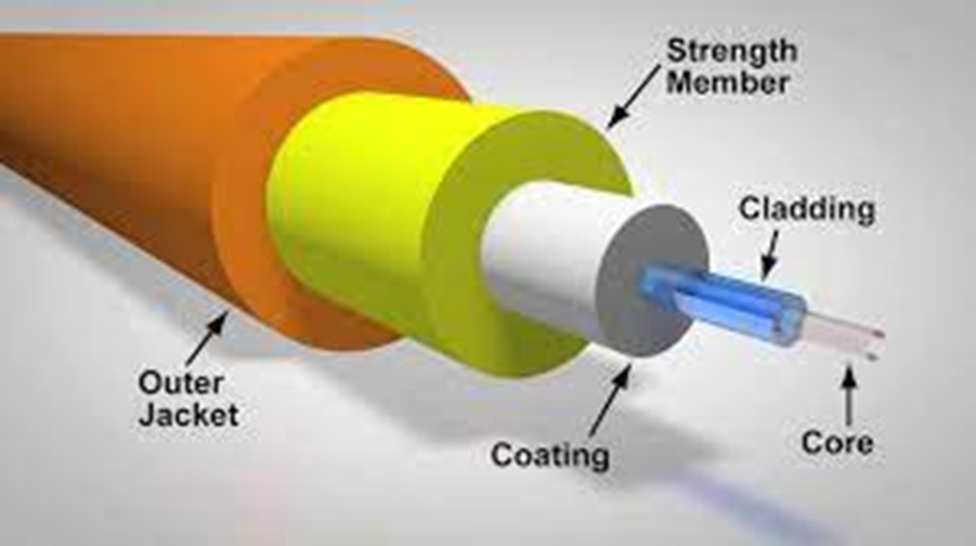
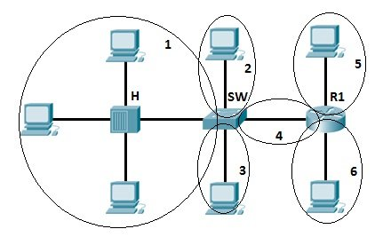

# 乙太區域網路基礎

* [2-1 區域網路概述](#2-1-區域網路概述)
  * [2-1.1 典型的 SOHO 區域網路](#2-11-典型的-soho-區域網路)
  * [2-1.2 典型的企業區域網路](#2-12-典型的企業區域網路)
  * [2-1.3 實體層標準的種類 (纜線)](#2-13-實體層標準的種類-纜線)
  * [2-1.4 所有線路使用乙太網路資料鏈接層的共通性：frame](#2-14-所有線路使用乙太網路資料鏈接層的共通性frame)

* [2-2 以UTP建構實體的乙太區域網路](#2-2-以utp建構實體的乙太區域網路)
  * [2-2.1 使用雙絞線傳送資料](#2-21-使用雙絞線傳送資料)
  * [2-2.2 解析 UTP 乙太網路線](#2-22-解析-utp-乙太網路線)
  * [2-2.3 10BASE-T 和 100BASE-T 的 UTP 線接腳 (四條芯線)](#2-23-10base-t-和-100base-t-的-utp-線接腳-四條芯線)
  * [2-2.4 1000BASE-T 的 UTP 線接腳 (八條芯線)](#2-24-1000base-t-的-utp-線接腳-八條芯線)

* [2-3 使用光纖建立實體乙太區域網路](#2-3-使用光纖建立實體乙太區域網路)
  * [2-3.1 光纖(Optical fiber)佈線的傳輸概念](#2-31-光纖optical-fiber佈線的傳輸概念)
  * [2-3.2 透過光纖使乙太網路](#2-32-透過光纖使乙太網路)

* [2-4 乙太區域網路內傳送資料](#2-4-乙太區域網路內傳送資料)
  * [重點：訊框(frame)](#重點訊框frame)
  * [乙太網路定址：MAC](#乙太網路定址mac)
  * [2-4.1 用 Switch / Hub 傳送訊框](#2-41-用-switch--hub-傳送訊框)
  * [2-4.2 Collision Domain & Broadcast Domain](#2-42-collision-domain--broadcast-domain)
  
* [關鍵詞彙](#關鍵詞彙)

* [問答題](#問答題)

## 2-1 區域網路概述

**乙太網路(Ethernet)**：

「乙太網路」指的是一系列的區域網路(LAN)標準，定義了實體層與資料鏈接層，為世界上使用最廣泛的**有線**LAN技術。

這些標準由IEEE制定，包括纜線、連接纜線的接頭、通訊協定的規則、以及其他創建Ethernet的一切所需。

Ethernet 的編號為 **802.3**，而 Wi-Fi 的編號為 **802.11**。雖然兩者皆可實現區域網路，但提到「乙太網路」時，就是指 802.3。

### 2-1.1 典型的 SOHO 區域網路

小型辦公室（Small Office Home Office）簡稱為SOHO。

建構一個簡單的SOHO LAN，會用到：

* 交換器(switch)：提供實體埠讓纜線連接。
* 乙太網路線(Ethernet cables)：符合乙太網路標準的纜線規格。

現今典型的 SOHO LAN 也能支援無線區域網路(ex. 802.11)的連接，利用無線電波傳送位元。

* 大多數無線區域網路依賴另一種網路設備：無線區域網路存取點(access point, **AP**)，AP的功能類似 switch，所有的「無線網路節點都能和無線 AP 溝通」。

如果AP使用的是一台獨立的實體裝置，就需要一條Ethernet cable來連到LAN上，如下圖: 

### 2-1.2 典型的企業區域網路

企業級的乙太網路規模比起SOHO大得多，會依需求在各樓層部署網路線、switch，以及無線區域網路：

### 2-1.3 實體層標準的種類 (纜線)

Ethernet的標準來自於IEEE，其中也包括了纜線的具體標準。

* 乙太網路的所有標準，以 **802.3** 為標準開頭。

  > Wi-Fi 的標準則是以 **802.11** 開頭，兩者為不同的標準！！

* 選擇纜線不外乎是挑選材質，常見的有：

  * 銅線：例如 UTP，中文為「雙絞線」。

  * 玻璃纖維：更貴，但速度快、距離更常，也就是所謂的「光纖」。

乙太網路實體層的種類:

> 可以從結尾看出是光纖還是UTP：光纖(X)、UTP(T)

> 8 Mbps = 1 MB/s

### 2-1.4 所有線路使用乙太網路資料鏈接層的共通性：Frame

雖然在實體層中，乙太網路有各種不同的標準(纜線有好多種)，但在資料鏈接層中，使用的是**相同**的標準，也就是**訊框(frame)**：

* frame 定義了通用的乙太網路標頭、標尾。無論纜線、傳輸率為何，統一使用相同的標頭(尾)格式。

* 複習: frame = 標頭+標尾+夾在頭尾中的資料。

* 定義好訊框，在 Ethernet LAN 中的各個節點就可以藉由傳送訊框來傳遞訊息到正確的目的地。

> 實體層聚焦在纜線，乙太網路資料鏈接層則聚焦於 frame 的格式。每條纜線都可以有不同類型、材質、傳輸速率，但透過資料鏈接層的協定，就可以協同傳送資料。

## 2-2 以UTP建構實體的乙太區域網路

此小節具焦於「任兩個 Ethernet 節點的單一線路上」，特別是那些採用UTP的線路。

重點介紹三種最常見的 Ethernet 標準：10BASE-T(Ethernet)、100BASE-T(Fast Ethernet, FE), 1000BASE-T(Gigabit Ethernet, GE)。

**UTP**：無遮蔽雙絞線(Unshielded Twisted Pair，UTP)是一種數據傳輸線，由成對不同顏色的傳輸線互相纏繞所組成，廣泛用於乙太網路（區域網路）和電話線中。

**Fast Ethernet**：在長 100 公尺 UTP 上以 100 Mbps 的速率傳送訊框。

### 2-2.1 使用雙絞線傳送資料

首先，要先透過UTP內部的一對芯線(總共四對)，在兩台設備之間形成電路。

這兩台設備都遵循著編碼方式將電器訊號轉換到0或1 (例如10BASE-T使用的編碼方式能在1000萬分之一秒內將二進位的0從高電位轉到低電位)。

> 當電流流過纜線時，會產生電磁干擾(electromagnetic interference, EMI)，會干擾到同一條纜線中的其他的芯線(同條纜線中的芯線 EMI 稱為crosstalk)。如果將芯線互相纏繞而非平行，有助於抵銷 EMI。

### 2-2.2 解析 UTP 乙太網路線

乙太網路線(Ethernet link)指的是兩個Ethernet節點之間任何的實體纜線，基本的組成單元如下：

UTP纜線本身的組成單元：

* 10BASE-T、100BASE-T：兩對芯線

* 1000BASE-T：四對芯線

* 每一對芯線都有其色彩配置。

* 每一條芯線都有一層以顏色編碼的塑膠外層。

多數 UTP 兩端都使用 RJ-45 「接頭」，內含 8 個實體位置，作為纜線中 8 條芯線的接入處，稱為接腳位置(pin position，簡稱 pins)。

所以要完成實體網路，每個節點(電腦)都需要 RJ-45 乙太網路埠來連接 RJ-45 接頭：

* 乙太網路埠通常來自於網路卡(network interface controller，NIC)

### 2-2.3 10BASE-T 和 100BASE-T 的 UTP 線接腳 (四條芯線)

**Straight-through cable**

* 用於連接不同類型的設備，例如連接電腦和 switch。
* 腳位連線：
  * 1 對 1
  * 2 對 2
  * 3 對 3
  * 6 對 6

* 網路卡的配線規則：
  * 電腦：傳送腳位是 1 和 2，接收腳位是 3 和 6。
  * switch：傳送腳位是 3 和 6，接收腳位是 1 和 2。

**Crossover cable**

* 用於連接相同類型的設備，例如連接兩台電腦。
* 腳位連線：
  * 1 對 3
  * 2 對 6
  * 3 對 1
  * 6 對 2

  

**結論：選擇適合的纜線腳位**

綜上所述，可以分成兩種情況：

* 兩邊的發送腳位不同 -> straight-through
* 兩邊的發送腳位相同 -> crossover

| 1、2 傳送 | 3、6 傳送 |
| --------- | --------- |
| PC 網路卡 | Hub |
| Router    | Switch    |
| 無線 AP 的 Ethernet 埠 | - |

### 2-2.4 1000BASE-T 的 UTP 線接腳 (八條芯線)

1000BASE-T(Gigabit Ethernet)和 10/100BASE-T的差異：

* 1000BASE-T需要四對芯線(共八條)，所以額外會用到接腳 4、5、7、8。

* 腳位：
  * Straight through：使用四對芯線建立四條電路，其中兩個腳位與 10/100BASE-T 標準相同，在4、5增加一對，最後在7、8增加最後一對。

  * Crossover：規則同10/100BASE-T，1 & 2 對 3 & 6，4 & 5 對 7 & 8

## 2-3 使用光纖建立實體乙太區域網路

通常 UTP 的 Ethernet cable 最長是 100m，為了達到更長的距離，可以選用光纖。

除了傳輸距離長，光纖還有其他的優點，相對的也有缺點，這就是接下來要討論的內容

### 2-3.1 光纖(Optical fiber)佈線的傳輸概念

使用玻璃作為光訊號透過的媒介。

* 玻璃有易碎的風險，替代做法讓光纜使用柔性的玻璃纖維，並在外圍加上近一步的保護與強化(三個外層保護纜線內部，內部是纖衣(cladding)和纖芯搭配)

* 既然用光訊號傳送，所以需要有光源，這個光源就叫做「光發射器(optical transmitter)」，將光發射到纖芯中。

* 雖然光會穿透纖芯跑到外面，但纖衣會負責將穿透的光反射回來

而光纖則依光源進入纖芯角度的「多寡」分為：

* 多模光纖(Multimode)：光進入纖芯有多個角度，提高 UTP 傳輸的最大距離，光發射器也比較便宜。(使用 LED 光源)

* 單模光纖(Singlemode)：傳輸距離比多模更遠，但比較貴。(使用雷射光源)

### 2-3.2 透過光纖使乙太網路

* 需要有 SFP (Small Form-factor Pluggable) 或 SFP+ 的連接埠：

> SFP 中文是「小封裝可插拔收發器」，是一種小型的光模組。SFP+ 則比 SFP 更快，支援 10Gbps 的傳輸速度。 

SFP port 支援的光纖類型，可參考以下常見的 IEEE 802.3 10 Gbps 光纖標準：

| 標準 | 類型 | 最大距離 |
| ---- | ---- | -------- |
| 10GBASE-S | MM | 400 M |
| 10GBASE-LX4 | MM | 300 M |
| 10GBASE-LR | SM | 10 KM |
| 10GBASE-E | SM | 30 KM |
> MM：多模光纖，SM：單模光纖

總和以上，下表統整 UTP、MM、SM 的比較：

| 項目 | UTP | MM | SM |
| ---- | --- | -- | -- |
| 佈線成本 | 低 | 中 | 高 |
| Switch port 成本 | 低 | 中 | 高 |
| 最大距離 | 100m | 500m | 40km |
| 易受干擾 | 一些 | 無 | 無 |
| 訊號擷取風險 | 一些 | 無 | 無 |

## 2-4 乙太區域網路內傳送資料

### 重點：訊框(frame)

| 欄位 | 長度 | 說明 |
| ---- | ---- | ---- |
| Preamble | 7 bytes | 用於同步 |
| 訊框起始定義符(SFD) | 1 byte | 表示下一個 byte 從目的地的 MAC 開始 |
| 目的地 MAC | 6 bytes | 識別接收端 |
| 來源地 MAC | 6 bytes | 識別發送端 |
| 類型 | 2 bytes | 識別 IPv4 or IPv6 |
| 資料 | 46-1500 bytes | 上層資料，通常是 L3PDU，不足 46 bytes 補 0 |
| FCS (Frame Check Sequence) | 4 bytes | 錯誤檢查碼 |

> 錯誤檢查**不等於**錯誤復原，乙太網路會丟棄錯誤的訊框，不像 TCP 會請求重傳。

> Error Detection != Error Recovery

### **乙太網路定址：MAC**

MAC (Media Access Control) 用來在乙太網路中定址(準確來說是在第二層中定址)，長度為 6 bytes，結構如下：

* OUI (Organizationally Unique Identifier)：前三個 bytes，是 IEEE 分配給網卡製造商的唯一識別碼。

* NIC (Network Interface Controller)：後三個 bytes，是製造商分配給網卡的唯一識別碼。

* MAC 通常用 16 進位表示，例如：00:60:2F:3A:07:BC。

> 網卡製造商將這 6 bytes 的 MAC 地址寫入網卡的 ROM 中，這個地址就是「burned-in address (BIA)」。

根據用途，MAC 有以下三種類型的地址：

1. 單點地址 (Unicast)：通訊雙方的 MAC 位址不同。

2. 廣播地址 (Broadcast)：傳送到某區網的 FF:FF:FF:FF:FF:FF，代表傳遞到該區網的所有設備。

3. 群播地址 (Multicast)：傳送到該地址的 frame，會被該區網一部份有意願的設備接收。

### 2-4.1 用 Switch / Hub 傳送訊框

* 全雙工(full-duplex)：可同時傳送和接收，不會有碰撞。

* 半雙工(half-duplex)：不可同時傳送和接收。需「等待」網路不忙碌才能傳送。

若兩台電腦之間的 switch 都是全雙工，這兩台電腦都可以同時傳送訊框給對方，因為兩個方向上都沒有半雙工的限制。

> 注意：通訊雙方都支援全雙工不代表兩邊「一定都要用全雙工」，只是比較推薦這個設定，但仍然可以選擇半雙工。

**Hub**

* Hub 被認為是實體層的裝置，因為它用電氣訊號來傳送，並沒有訊框的概念。

* Hub 也沒有地址的概念，端純用 port 來區分來源和目的地。

* 當電器訊號進入 hub，它會將訊號複製到所有的埠上，也就是所有連上 hub 的設備都會收到訊號。

* Hub 的缺點是若兩台機器同時傳送訊號，電氣會碰撞形成干擾，導致訊號失真。

那要如何防止碰撞呢？答案就是「等待」，等待一方傳送完畢再傳送(半雙工)，具體演算法是「CSMA/CD」。

**CSMA/CD**

CSMA/CD (Carrier Sense Multiple Access with Collision Detection) 具體實作如下：

1. 設備監聽到網路不忙碌後，才能傳送訊框。
2. 設備開始傳送訊框。
3. 傳送端會監聽訊框是否發生碰撞，如果有，所有正在傳送訊框的設備要做到以下幾點：
  * 發出干擾訊號，告訴所有設備有碰撞發生。
  * 各自隨機等待一段時間。
  * 等待一段時間後，再從步驟 1 開始。

### 2-4.2 Collision Domain & Broadcast Domain

* Collision Domain：指的是一個區域網路中，可能發生碰撞的範圍。
  * 有四台電腦連接到 hub，這四台電腦就是一個 collision domain。
  * 有四台電腦連接到 switch，因為 switch 有全雙工的特性，則這四台電腦各自是一個 collision domain。(共有四個 collision domain)

  

  > 有 6 個 collision domain。

* Broadcast Domain：指的是一個區域網路中，廣播訊息會被傳送到的範圍。通常用第二層連接起來的設備同屬一個 broadcast domain。

  

  > 有 3 個 broadcast domain。

## 關鍵詞彙

* Ethernet

* IEEE

* Wired LAN

* Wireless LAN

* Ethernet frame

* NIC (Network Interface Card)

* straight-through cable

* crossover cable

* unicast address

* broadcast address

* FCS (Frame Check Sequence)

* fiber optic cable

* cladding

* MM (Multimode)

* SM (Singlemode)

* EMI (Electromagnetic Interference)

## 問答題

  
答案

Ans：1

> Explanation：The IEEE defines Ethernet LAN standards, with standard names that begin with 802.3, all of which happen to use cabling. The IEEE also defines wireless LAN standards, with standard names that begin with 802.11, which are separate standards from Ethernet.

  
答案

Ans：3

> Explanation：The 4-byte Ethernet FCS field, found in the Ethernet trailer, allows the receiving node to see what the sending node computed with a math formula that is a key part of the error-detection process. Note that Ethernet defines the process of detecting errors (error detection), but not error recovery.

  
答案

Ans：2、3、5

> Explanation：The pre-assigned universal MAC address, given to each Ethernet port when manufactured, breaks the address into two 3-byte halves. The first half is called the organizationally unique identifier (OUI), which the IEEE assigns to the company that builds the product as a unique hex number to be used only by that company.

  
答案

Ans：2

> Explanation：NICs (and switch ports) use the carrier sense multiple access with collision detection (CSMA/CD) algorithm to implement half-duplex logic. CSMA/CD attempts to avoid collisions, but it also notices when collisions do occur, with rules about how the Ethernet nodes should stop sending, wait, and try again later.

  
答案

Ans：3、4

> Explanation：Ethernet supports unicast addresses, which identify a single Ethernet node, and group addresses, which can be used to send one frame to multiple Ethernet nodes. The two types of group addresses are the broadcast address and multicast address.

  
答案

Ans：2、4、5

> Explanation：Routers, wireless access point Ethernet ports, and PC NICs all send using pins 1 and 2, whereas hubs and LAN switches transmit on pins 3 and 6. Straight-through cables connect devices that use opposite pin pairs for sending, because the cable does not need to cross the pairs.

  
答案

Ans：2

> Explanation：Crossover cables cross the wire at one node’s transmit pin pair to the different pins used as the receive pins on the other device. For 10- and 100-Mbps Ethernet, the specific crossover cable wiring connects the pair at pins 1 and 2 on each end of the cable to pins 3 and 6 on the other end of the cable, respectively.

  
答案

Ans：2、4

> Explanation：Multimode fiber works with LED-based transmitters rather than laser-based transmitters. Two answers mention the type of transmitters, making one of those answers correct and one incorrect.Two answers mention distance. The answer that mentions the longest distance possible is incorrect because single-mode cables, not multimode cables, provide the longest distances. The other (correct) answer mentions the tradeoff of multimode being used for distances just longer than UTP’s 100 meter limit, while happening to use less expensive hardware than single mode.

  
答案

Ans：3

> Explanation：The number before the word BASE defines the speed, in megabits per second (Mbps). 1000 Mbps equals 1 gigabit per second (1 Gbps). The T in the suffix implies twisted-pair or UTP cabling, so 1000BASE-T is the UTP-based Gigabit Ethernet standard name.

