# WAN 與 IP 路由基礎

* [3-1 廣域網路 WAN](#3-1-廣域網路-wan)
  * [3-1.1 WAN 專線](#3-11-wan-專線)
  * [3-1.2 WAN 乙太網路](#3-12-wan-乙太網路)

* [統整以上建立 WAN 的兩大方式：](#統整以上建立-wan-的兩大方式)

* [3-2 IP 路由](#3-2-ip-路由)
  * [3-2.1 網路層路由(轉送)邏輯](#3-21-網路層路由轉送邏輯)
  * [3-2.2 網路層如何使用 LAN 與 WAN](#3-22-網路層如何使用-lan-與-wan)
  * [3-2.3 IP 子網的劃分原則](#3-23-ip-子網的劃分原則)
  * [3-2.4 Router 如何學習路由規則？](#3-24-router-如何學習路由規則)

* [3-3 其他網路層功能]
  * [3-3.1 DNS](#3-31-dns)
  * [3-3.2 ARP](#3-32-arp)
  * [3-3.3 Ping](#3-33-ping)

* [問答題](#問答題)

## 3-1 廣域網路 WAN

WAN：定義了用於「長距離通訊」的實體層 & 資料鏈接層協定

### 3-1.1 WAN 專線

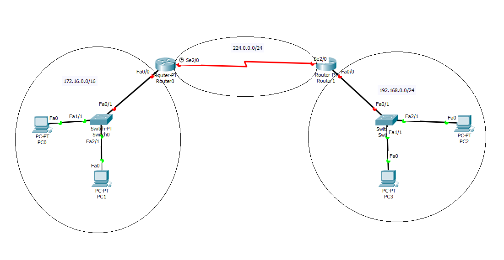

如上圖所示，左右兩邊都是 LAN，中間利用 WAN 來連接。

LAN 連到 WAN 的出口，在上圖中為「路由器」，如果是公司企業的話，兩個路由器之間的連線須由網路工程師來安排某種 WAN 線路，其中一種就是「WAN 專線」。(圖中紅色彎曲的線路代表省略了實體細節)。

**專線的實體細節**

專線服務：

* 全雙工

* 專線與乙太網路 crossover cable 的不同處：實際上並非存在於兩點之間的一條「長電纜」，而是電信公司鋪設的電纜網路。

* 電信公司通常不會特別幫你鋪設線路，而是從現有的線路中規劃出一條線路給你使用。

* 用戶其實不知道電信公司怎麼鋪設的，不過用起來就像是一條 crossover cable。

* 專線的定義：使用專線的用戶本身不擁有這條線路，必須**租用**。


相關的專有名詞與解釋：

| 名詞 | 解釋 |
| --- | --- |
| 專線、電路 (Leased circuit, Circuit) | Line 與 circuit 同意，意指兩點之間的電氣電路。 |
| 序列鏈路、序列線路 (Serial link, Serial Line) | Link 與 Line 同意，Serial 意指位元的連續傳送，路由器就是用的「序列埠」來傳輸。 |
| 點對點鏈路、點對點線路 (Point-to-Point link, Point-to-Point Line) | 在兩點之間展開的連線，且只能在這兩點之間。 |
| T1 | 專線的特殊類型，1.544 Mbps 的傳輸率。 |
| WAN 線路、鏈路 (WAN link, Link) | 普遍的詞語，沒有限定特定的技術 |
| 私有線路 (Private Line) | 該線路上傳送的資料無法被他人複製，資料是私有的。 |
| 局端 (Central Office, CO) | 電信公司自己的交換器，通常位於建築物內。 |

**專線的 HDLC 資料鏈接層細節**

專線本身提供的是第一層的服務，但專線並沒有定義第二層(資料鏈接層)的協定。

由於專線只定義第一層，因此許多公司與標準化組織創造了資料鏈階層協定，最常見的有：

* HDLC (High-Level Data Link Control)
* PPP (Point-to-Point Protocol)

> 資料鏈接層協定之目的：將資料控制在一條特定的線路上，並確保正確傳送。(例如乙太網路的資料鏈階層使用 FCS 來判斷 frame 是否正確)

HDLC Frame 與乙太網路 Frame 的格式對照：

| HDLC 欄位 | 對應的乙太網路 Frame 欄位 | 說明 |
| --- | --- | --- |
| Flag | Preamble, SFD | 用來同步的，讓接收方知道一個新的 frame 正在抵達 |
| Address | Destination Address | 用來識別 frame 的目的地 |
| Control | 無 | 現在很少用這個欄位 |
| Type | Type | 用來識別第三層封包的類型 |
| FCS | FCS | 用來檢查 frame 是否正確 |

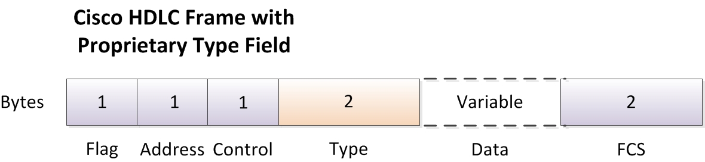

* 上述的 Type 欄位其實是 Cisco 自己制定的 HDLC 格式，因為路由器需要知道這個封包的類型。原本 ISO 制定的 HDLC 是沒有這個欄位的。

* 與乙太網路不同的是，HDLC 大多處理的是**兩點之間**的傳輸，所以實際上 Address 並不是那麼重要，反正來來去去都是這兩個人互相說話。

> HDLC frame 和 Ethernet frame 是兩種不同東西。

**路由器如何使用 WAN 資料線路**

價如現在有一個網路架構如下：

```
PC1 <---> R1 <---> R2 <---> PC2
```

* PC1、PC2：兩台電腦
* R1、R2：兩台路由器

假設現在 PC1 要傳訊息給 PC2，在網路層(第三層)會經過以下步驟：

1. PC1 的網路層(IP)邏輯告訴它，要把封包丟給 R1。

2. R1 的網路層(IP)邏輯告訴它，要把封包丟給 R2。

3. R2 的網路層(IP)邏輯告訴它，要把封包丟給 PC2。

但我們知道實際上傳遞封包不可能只有第三層，也會經過第二層(資料鏈接層)。因此在第二層的資料鏈接層會經過以下步驟：

> 以下假設 R1 與 R2 之間是使用 HDLC 協定。

1. PC1 將 IP 封包裝進 Ethernet Frame，以 R! 的 MAC 位址為目的地，並將 Ethernet Frame 丟給 R1。

2. R1 把 Ethernet Frame 做 de-encapsulation (解封)，取出 IP 封包，並將 IP 封包裝進 HDLC Frame，然後丟給 R2。

3. R2 將 HDLC Frame 做 de-encapsulation，取出 IP 封包，並將 IP 封包裝進 Ethernet Frame，以 PC2 的 MAC 位址為目的地，並丟給 PC2。

總結：

* HDLC 專線在兩台路由器之間建立了 WAN 線路。

* 專線提供實體的方式來雙向傳送位元。

* 專線的服務方向主打「專屬」，因此有較高隱私性。

* 但按照今天的標準，專線的速度已經不夠快了(僅數十 Mbps)。取代的主流方式為以下要介紹的乙太網路。

### 3-1.2 WAN 乙太網路

在以前，乙太網路由於纜線長度與設備的限制，最多延伸一兩公里就沒了，僅能拿來做 LAN。

但後來 IEEE 改良了乙太網路的標準，支援了「光纖」，使得乙太網路的範圍可以延伸到數十公里，例如上一章提到的：

* 1000BASE-LX 可以到 5 公里。

* 1000BASE-ZX 可以到 70 公里。

在 WAN 的實作上與專線很像，只不過中間連接的設備就是「乙太網路線與設備」。

乙太網路線路離開客戶建築物後，會連到被稱為「網路連接點(Point of Presence, **POP**)」的地方，這裡是 WAN 供應商(**SP**)的乙太網路設備。


**建立第二層服務的 WAN 乙太網路**

運作方式也和 cross-over cable 類似，換句話說：

* 邏輯上：像是兩台路由器之間的點對點連線。
* 實體上：像是兩台路由器之間有實體光纖。

乙太 WAN 的常見專有名詞如下：

* 乙太網線路服務 (E-Line)：表示點對點的乙太廣域網路服務。

* 乙太網路仿真：強調「線路並不是真的終端對終端」的術語。

* MPLS 上的乙太網路(EoMPLS)：為客戶建立**WAN 乙太網路**服務的多協定標籤交換(MPLS)技術。

---

**MPLS 是什麼？**

多重通訊協定標籤交換 (MPLS) 是一種加速網路連線的技術，於 1990 年代首次開發。「MPLS」開頭的 MP 指的是「多協定」，代表可以彈性的支援多種通訊協定。

* 傳統上：封包從一個路由器轉寄到另一個路由器，直到封包到達目的地。

* MLPS：沿著預先確定的網路路徑 (LSP) 傳送封包。理想情況下，其結果是路由器花費更少的時間來決定每個封包的轉寄位置，並且每次封包都採用相同的路徑。

> MPLS 被認為是在 OSI 的「2.5」層運作，低於網路層（第 3 層），高於資料連結層（第 2 層）。

在使用 MPLS 的網路中，每個封包都被指派到一個稱為「轉寄等價類 (FEC)」的類別。封包可以採用的網路路徑稱為標籤交換路徑 (LSP)。封包的類別 (FEC) 決定了封包將被指派到哪個路徑 (LSP)。具有相同 FEC 的封包遵循相同的 LSP。

MPLS 會在封包上附加上標頭，該標頭含有「標籤」，而路由器只會根據標籤來轉發，而不用拆開檢查後再根據 IP 位址來轉發。

由於支援 MPLS 的路由器只需要查看附加到封包的 MPLS 標籤，因此 MPLS 幾乎可以使用任何通訊協定（因此稱為「多重通訊協定」）。封包的其餘部分如何進行格式設定並不重要，只要路由器可以讀取封包前面的 MPLS 標籤即可。

***

**路由器如何使用乙太網路傳送封包？**


```
PC1 <---> R1 <---> R2 <---> PC2
```


以下為 PC1 傳送 IP 封包給 PC2 的過程：

1. PC1 將 IP 封包裝進 Ethernet Frame，以 R! 的 MAC 位址為目的地，並將 Ethernet Frame 丟給 R1。

2. R1 把 Ethernet Frame 做 de-encapsulation (解封)，取出 IP 封包，並將 IP 封包裝進新的 Ethernet Frame，以 R2 的 MAC 位址為目的地(來源 MAC 位址為 R1)，然後丟給 R2。

3. R2 將 Ethernet Frame 做 de-encapsulation，取出 IP 封包，並將 IP 封包裝進 Ethernet Frame，以 PC2 的 MAC 位址為目的地，並丟給 PC2。

> 可以發現每台路由器都會丟掉原本 Frame 的 header 和 trailer，然後再重新包裝成新的 Frame。

## 統整以上建立 WAN 的兩大方式：


| | 專線 | 乙太網路 |
|---| --- | --- |
| **常用協定** | HDLC、PPP | MPLS |
| **Frame** | HDLC Frame | Ethernet Frame |
| **速度** | 較慢 | 較快 |
| **WAN 供應商設備** | Central Office (CO) | Point of Presence (PoP) | 


## 3-2 IP 路由

以下介紹的是 IPv4

### 3-2.1 網路層路由(轉送)邏輯

在 TCP/IP 網路中，路由器與使用者電腦稱為「主機」。

主機的作業系統含有 TCP/IP 軟體，該軟體會決定將封包傳送到哪個路由器。

轉送邏輯：

* 如果接收方的 IP 和發送方不在同一個子網(網域)，發送方就會查找自己的路由表(Routing Table)，把封包交給能幫忙轉傳的主機(通常是 default gateway)。

* 如果轉送之後還是沒到目的地，就會再次查找路由表、再次轉送，直到到達目的地。

> Default Gateway：同一個 LAN 中的路由器。

### 3-2.2 網路層如何使用 LAN 與 WAN

當一個 Frame 抵達路由器，路由器會做以下事情：

1. 使用資料鏈接層 frame 的 FCS 檢查 frame 是否正確，錯誤則丟棄。

2. 若上一步驟 FCS 正確，路由器會解封 frame (去掉標頭標尾)，取出 IP 封包。

3. 將 IP 封包內的目的地 IP 與路由表比對，找到抵達目的地的路徑。

4. 選好路徑後，下一站可能有三種情況：

  * 假如下一站是路由器，且採取 HDLC 連線，則將 IP 封包裝進 HDLC Frame，然後從「序列埠 (Serial Port)」直接傳到下一站。

  * 假如下一站是路由器，且採取乙太網路，則將 IP 封包裝進 Ethernet Frame，並在標頭中使用自己的 MAC 與下一站的 MAC 做為來源與目的，然後經由「乙太網路介面」傳送到下一站。

  * 如果下一站直接就是目的地(與路由器處在同一個網域)，則將 IP 封包裝進 Ethernet Frame，並在標頭中使用自己的 MAC 與目的地的 MAC 做為來源與目的，然後經由「乙太網路介面」傳送到目的地。

從上面可以發現，路由器必須建立新的 Frame 標頭與標尾，而新標頭又比需有資料鏈接層的位址(MAC)，所以會使用**ARP(Address Resolution Protocol)**來學習 LAN 中其他主機的 IP 與 MAC 的對應。

> 關於 ARP 本章後面會再介紹。

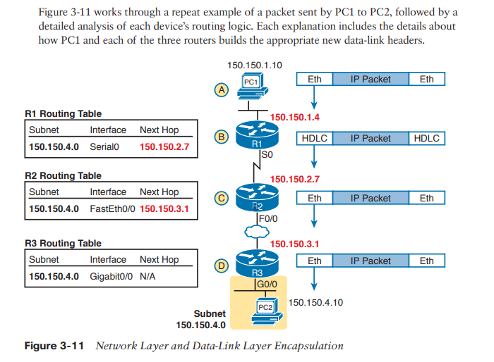

### 3-2.3 IP 子網的劃分原則

IP 定址時會切分子網(subnet)，也就是前面說的「網域」。例如 192.168.132.0/24 與 192.168.140.0/24 就是兩個不同的子網。

雖然說每張網路卡你都可以自行設定 IP，你可以設定讓兩台相隔很遠的電腦隸屬於同一個子網，但這樣的設定顯然不合邏輯且不易管理。

因此劃分子網時，可以參考兩個基本原則：

* 當兩個 IP 位址中間沒有任何路由器時，這兩個 IP 位址應該被劃分到同一個子網。

* 當兩個 IP 位址中間有一個或多個路由器時，這兩個 IP 位址應該被劃分到不同的子網。

### 3-2.4 Router 如何學習路由規則？

Router 透過 Routing Protocol 來學習路由規則，Routing Protocol 負責的是「Router 與 Router 之間互相學習路由規則」。

> 注意：Routing Protocol 是 Router 之間學習路由規則的工具，與 IP 封包的傳遞無關！

路由的學習過程：

1. 每台路由器先將「直接連到自己的子網」加入路由表。(這可以自己完成，所以不用 Routing Protocol)

2. 每台路由器告訴它的鄰居自己的路由表(鄰居間彼此交換路由表，需要 Routing Protocol 的幫助)。

3. 將學到的路由規則加入自己的路由表(新加入的規則中，目的地就是傳授此規則的路由器)。

來看一個例子：

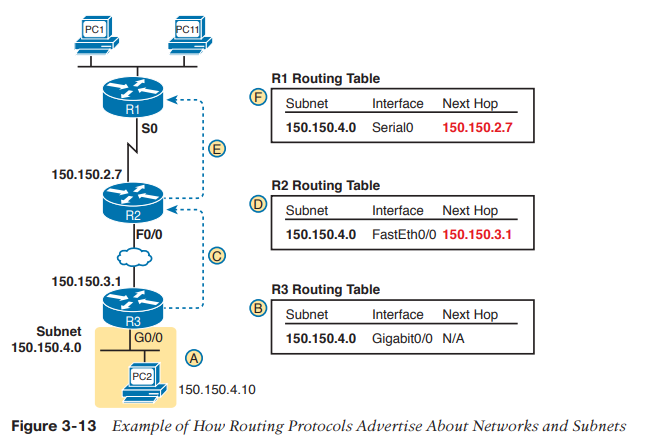

A：子網 150.150.4.0 位於圖中的最下面，連接到 R3。

B：R3 添加一條直連路徑 150.150.4.0 到自己的 IP 路由表。此步驟無須透過 Routing Protocol 的幫助。

C：R3 發送一條「路徑更新( routing update )到 R2，讓 R2 學習子網 150.150.4.0。(需要 Routing Protocol 的幫助)

D：R2 發送一條「路徑更新」到 R1，讓 R1 學習子網 150.150.4.0。(需要 Routing Protocol 的幫助)

F：R1 添加一條子網 150.150.3.0 到自己的 IP 路由表，該規則因為是從 R2 學到的，所以會從介面 Serial0 出發，next hop 是 R2 (150.150.2.7)。

## 3-3 其他網路層功能

* DNS

* ARP

* Ping

### 3-3.1 DNS

如果想要使用 fackbook 的網頁，我們不需要知道 fackbook server 的 IP，而是輸入「www.facebook.com」 就可以了，這是因為 DNS server 幫我們做了「IP 與 Domain Name 的對應」，例如：

| Name | IP |
| --- | --- |
| www.facebook.com | 10.1.2.3 |
| Server 1 | 192.168.132.1 |

> DNS 也不一定要用網址來對應 IP。例如在私人網域中，因為不是在 Internet 上，所以不用遵循網址的規則，可以自己任意幫 Server 取名。

DNS 的運作流程：

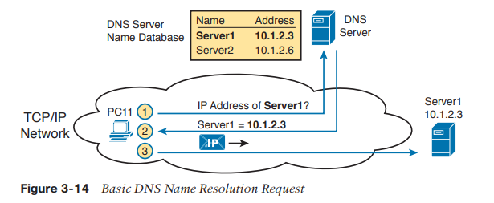

### 3-3.2 ARP

* 目的：學習 LAN 中其他主機的 IP 與 MAC 的對應。

ARP 定義了一個通訊協定，其中包含了 ARP Request 與 ARP Reply：

* ARP Request：

  當一台主機想要知道另一台主機的 MAC 位址時，會發送 ARP Request 封包到 LAN 中的所有主機(廣播)，說：「我的 IP 是 XXX，MAC 是 XXX。如果你的 IP 是 YYY，請回應你的 MAC」。

* ARP Reply：

    當收到 ARP Request 後，發現 Request 中的 IP 是自己的，就會告訴發送者自己的 MAC 位址，並將發送者的 IP 與 MAC 學起來。如果查詢對象不是自己，則不會學習新的 ARP，而是忽略 ARP Request。

> 透過這樣一來一往的對話，雙方都能學到對方的 IP 與 MAC 的對應。

主機知道 IP 與 MAC 的對應後，會將這個對應紀錄在 ARP Cache 中，以後再次要傳送封包時，就不用再次發送 ARP Request。

* ARP cache 的資料有被清理的可能，清理時機如下：
  
 1. ARP cache 滿了，會從中刪除最久沒用到的資料。

 2. ARP cache 資料有存活倒數計時，如果倒數計時結束還沒被使用，資料會被清除。反之如果資料被使用過，計時器會重新設定。

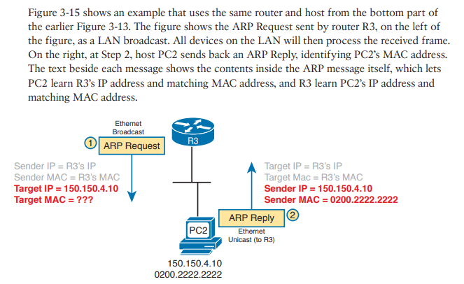

***

**補充：查看自己主機的 ARP Cache**：

```bash
arp -a
```

輸出：

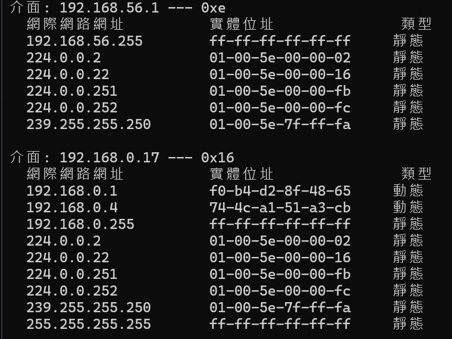

### 3-3.3 Ping

Ping 使用 ICMP (第三層協定) 發送 ICMP Echo Request 封包到目的地，目的地收到後會回應 ICMP Echo Reply 封包。

* 如果收到 Reply，代表兩者之間可以互相傳送封包。

## 問答題

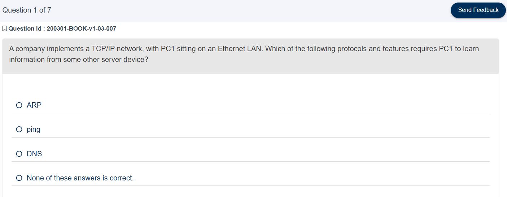

<details>
  <summary>答案</summary>

Ans：3

> Explanation：Address Resolution Protocol (ARP) does allow PC1 to learn information, but the information is not stored on a server. The ping command does let the user at PC1 learn whether packets can flow in the network, but it again does not use a server. With the Domain Name System (DNS), PC1 acts as a DNS client, relying on a DNS server to respond with information about the IP addresses that match a given hostname.

</details>

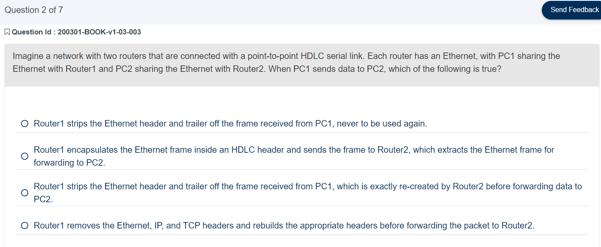

<details>
  <summary>答案</summary>

Ans：1

> Explanation：PC1 will send an Ethernet frame to Router 1, with PC1’s MAC address as the source address and Router 1’s MAC address as the destination address. Router 1 will remove the encapsulated IP packet from that Ethernet frame, discarding the frame header and trailer. Router 1 will forward the IP packet by first encapsulating it inside an HDLC frame, but Router 1 will not encapsulate the Ethernet frame in the HDLC frame but rather the IP packet. Router 2 will de-encapsulate the IP packet from the HDLC frame and forward it onto the Ethernet LAN, adding a new Ethernet header and trailer, but this header will differ. It will list Router 2’s MAC address as the source address and PC2’s MAC address as the destination address.

</details>

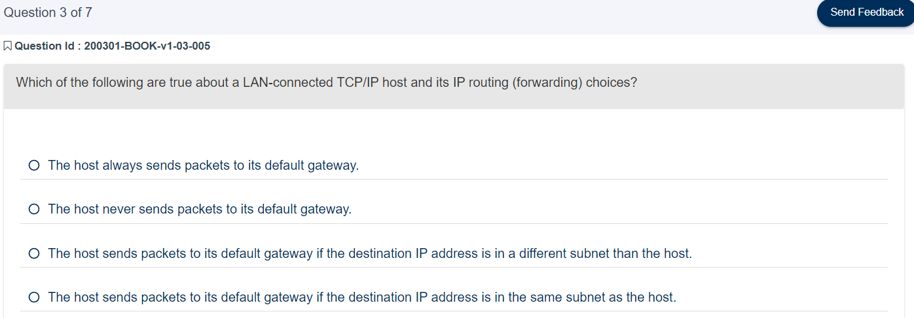

<details>
  <summary>答案</summary>

Ans：3

> Explanation：IPv4 hosts generally use basic two-branch logic. To send an IP packet to another host on the same IP network or subnet that is on the same LAN, the sender sends the IP packet directly to that host. Otherwise, the sender sends the packet to its default router (also called the default gateway).

</details>

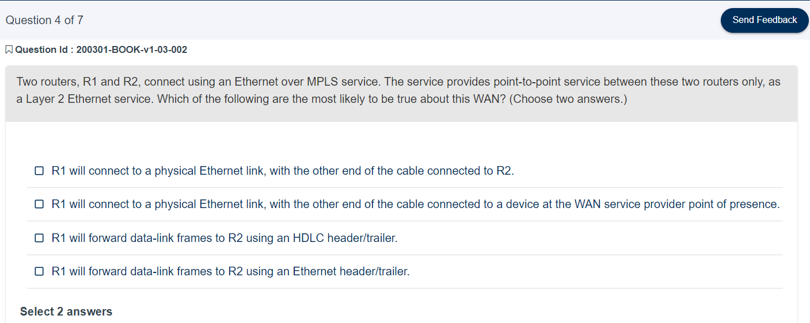

<details>
  <summary>答案</summary>

Ans：2、4

> Explanation：The physical installation uses a model in which each router uses a physical Ethernet link to connect to some SP device in an SP facility called a point of presence (PoP). The Ethernet link does not span from each customer device to the other. From a data-link perspective, both routers use the same Ethernet standard header and trailer used on LANs; HDLC does not matter on these Ethernet WAN links.

</details>

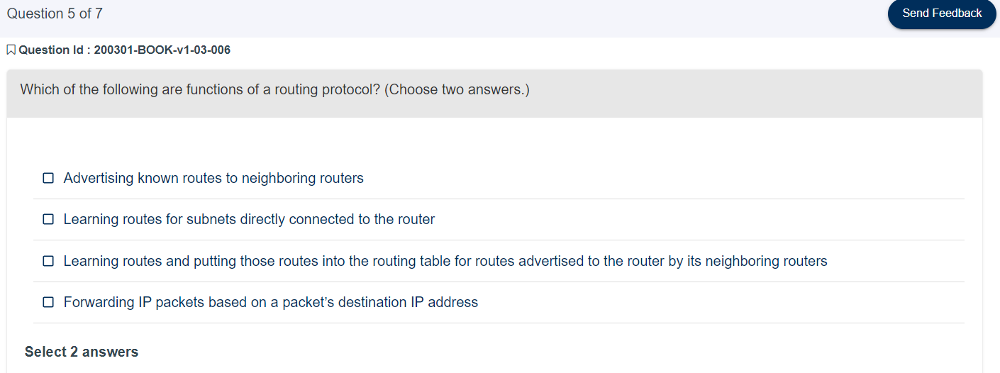

<details>
  <summary>答案</summary>

Ans：1、3

> Explanation：Routers do all the actions listed in all four answers; however, the routing protocol does the functions in the two listed answers. Independent of the routing protocol, a router learns routes for IP subnets and IP networks directly connected to its interfaces. Routers also forward (route) IP packets, but that process is called IP routing, or IP forwarding, and is an independent process compared to the work of a routing protocol.

</details>

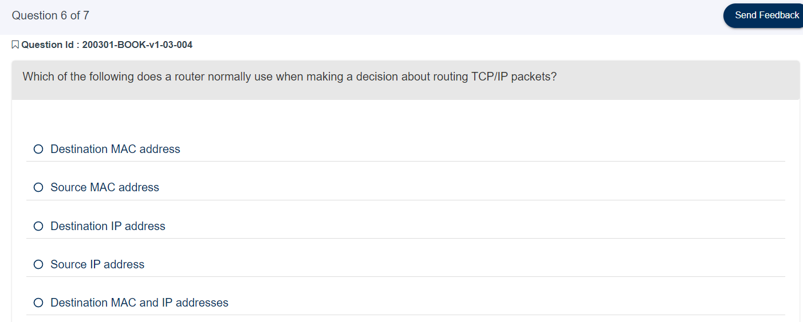

<details>
  <summary>答案</summary>

Ans：3

> Explanation：Routers compare the packet’s destination IP address to the router’s IP routing table, making a match and using the forwarding instructions in the matched route to forward the IP packet.

</details>

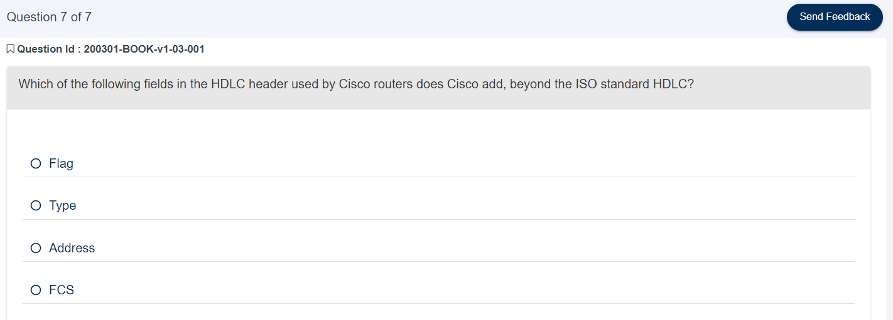

<details>
  <summary>答案</summary>

Ans：2

> Explanation：The ISO standard HDLC header does not have a Type field, and routers need to know the type of packet inside the frame. So, Cisco routers use a Cisco-proprietary variation of HDLC that adds a Type field.
