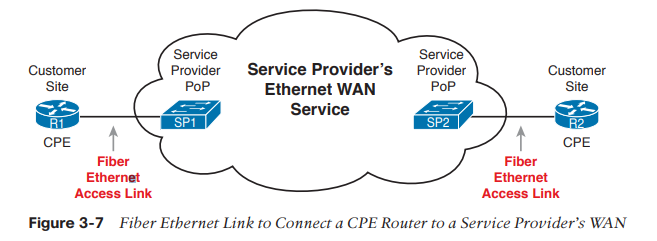

# WAN 與 IP 路由基礎

## 3-1 廣域網路 WAN

WAN：定義了用於「長距離通訊」的實體層 & 資料鏈接層協定

### 3-1.1 WAN 專線


如上圖所示，左右兩邊都是 LAN，中間利用 WAN 來連接。

LAN 連到 WAN 的出口，在上圖中為「路由器」，如果是公司企業的話，兩個路由器之間的連線須由網路工程師來安排某種 WAN 線路，其中一種就是「WAN 專線」。(圖中紅色彎曲的線路代表省略了實體細節)。

**專線的實體細節**

專線服務：

* 全雙工

* 專線與乙太網路 crossover cable 的不同處：實際上並非存在於兩點之間的一條「長電纜」，而是電信公司鋪設的電纜網路。

* 電信公司通常不會特別幫你鋪設線路，而是從現有的線路中規劃出一條線路給你使用。

* 用戶其實不知道電信公司怎麼鋪設的，不過用起來就像是一條 crossover cable。

* 專線的定義：使用專線的用戶本身不擁有這條線路，必須**租用**。


相關的專有名詞與解釋：

| 名詞 | 解釋 |
| --- | --- |
| 專線、電路 (Leased circuit, Circuit) | Line 與 circuit 同意，意指兩點之間的電氣電路。 |
| 序列鏈路、序列線路 (Serial link, Serial Line) | Link 與 Line 同意，Serial 意指位元的連續傳送，使用路由器的序列埠來連接。 |
| 點對點鏈路、點對點線路 (Point-to-Point link, Point-to-Point Line) | 在兩點之間展開的連線，且只能在這兩點之間。 |
| T1 | 專線的特殊類型，1.544 Mbps 的傳輸率。 |
| WAN 線路、鏈路 (WAN link, Link) | 普遍的詞語，沒有限定特定的技術 |
| 私有線路 (Private Line) | 該線路上傳送的資料無法被他人複製，資料是私有的。 |
| 局端 (Central Office, CO) | 電信公司自己的交換器，通常位於建築物內。 |

**專線的 HDLC 資料鏈接層細節**

專線本身提供的是第一層的服務，但專線並沒有定義第二層(資料鏈接層)的協定。

由於專線只定義第一層，因此許多公司與標準化組織創造了資料鏈階層協定，最常見的有：

* HDLC (High-Level Data Link Control)
* PPP (Point-to-Point Protocol)

> 資料鏈接層協定之目的：將資料控制在一條特定的線路上，並確保正確傳送。(例如乙太網路的資料鏈階層使用 FCS 來判斷 frame 是否正確)

HDLC Frame 與乙太網路 Frame 的格式對照：

| HDLC 欄位 | 對應的乙太網路 Frame 欄位 | 說明 |
| --- | --- | --- |
| Flag | Preamble, SFD | 用來同步的，讓接收方知道一個新的 frame 正在抵達 |
| Address | Destination Address | 用來識別 frame 的目的地 |
| Control | 無 | 現在很少用這個欄位 |
| Type | Type | 用來識別第三層封包的類型 |
| FCS | FCS | 用來檢查 frame 是否正確 |


* 上述的 Type 欄位其實是 Cisco 自己制定的 HDLC 格式，因為路由器需要知道這個封包的類型。原本 ISO 制定的 HDLC 是沒有這個欄位的。

* 與乙太網路不同的是，HDLC 大多處理的是**兩點之間**的傳輸，所以實際上 Address 並不是那麼重要，反正來來去去都是這兩個人互相說話。

**路由器如何使用 WAN 資料線路**

價如現在有一個網路架構如下：

```
PC1 <---> R1 <---> R2 <---> PC2
```

* PC1、PC2：兩台電腦
* R1、R2：兩台路由器

假設現在 PC1 要傳訊息給 PC2，在網路層(第三層)會經過以下步驟：

1. PC1 的網路層(IP)邏輯告訴它，要把封包丟給 R1。

2. R1 的網路層(IP)邏輯告訴它，要把封包丟給 R2。

3. R2 的網路層(IP)邏輯告訴它，要把封包丟給 PC2。

但我們知道實際上傳遞封包不可能只有第三層，也會經過第二層(資料鏈接層)。因此在第二層的資料鏈接層會經過以下步驟：

> 以下假設 R1 與 R2 之間是使用 HDLC 協定。

1. PC1 將 IP 封包裝進 Ethernet Frame，以 R! 的 MAC 位址為目的地，並將 Ethernet Frame 丟給 R1。

2. R1 把 Ethernet Frame 做 de-encapsulation (解封)，取出 IP 封包，並將 IP 封包裝進 HDLC Frame，然後丟給 R2。

3. R2 將 HDLC Frame 做 de-encapsulation，取出 IP 封包，並將 IP 封包裝進 Ethernet Frame，以 PC2 的 MAC 位址為目的地，並丟給 PC2。

總結：

* HDLC 專線在兩台路由器之間建立了 WAN 線路。

* 專線提供實體的方式來雙向傳送位元。

* 專線的服務方向主打「專屬」，因此有較高隱私性。

* 但按照今天的標準，專線的速度已經不夠快了(僅數十 Mbps)。取代的主流方式為以下要介紹的乙太網路。

### 3-1.2 WAN 乙太網路

在以前，乙太網路由於纜線長度與設備的限制，最多延伸一兩公里就沒了，僅能拿來做 LAN。

但後來 IEEE 改良了乙太網路的標準，支援了「光纖」，使得乙太網路的範圍可以延伸到數十公里，例如上一章提到的：

* 1000BASE-LX 可以到 5 公里。

* 1000BASE-ZX 可以到 70 公里。

在 WAN 的實作上與專線很像，只不過中間連接的設備就是「乙太網路線與設備」。

乙太網路線路離開客戶建築物後，會連到被稱為「網路連接點(Point of Presence, **POP**)」的地方，這裡是 WAN 供應商(**SP**)的乙太網路設備。




**建立第二層服務的 WAN 乙太網路**

運作方式也和 cross-over cable 類似，換句話說：

* 邏輯上：像是兩台路由器之間的點對點連線。
* 實體上：像是兩台路由器之間有實體光纖。

乙太 WAN 的常見專有名詞如下：

* 乙太網線路服務 (E-Line)：表示點對點的乙太廣域網路服務。

* 乙太網路仿真：強調「線路並不是真的終端對終端」的術語。

* MPLS 上的乙太網路(EoMPLS)：為客戶建立乙太網路服務的多協定標籤交換(MPLS)技術。

---

**MPLS 是什麼？**

多重通訊協定標籤交換 (MPLS) 是一種加速網路連線的技術，於 1990 年代首次開發。「MPLS」開頭的 MP 指的是「多協定」，代表可以彈性的支援多種通訊協定。

* 傳統上：封包從一個路由器轉寄到另一個路由器，直到封包到達目的地。

* MLPS：沿著預先確定的網路路徑 (LSP) 傳送封包。理想情況下，其結果是路由器花費更少的時間來決定每個封包的轉寄位置，並且每次封包都採用相同的路徑。

> MPLS 被認為是在 OSI 的「2.5」層運作，低於網路層（第 3 層），高於資料連結層（第 2 層）。

在使用 MPLS 的網路中，每個封包都被指派到一個稱為「轉寄等價類 (FEC)」的類別。封包可以採用的網路路徑稱為標籤交換路徑 (LSP)。封包的類別 (FEC) 決定了封包將被指派到哪個路徑 (LSP)。具有相同 FEC 的封包遵循相同的 LSP。

MPLS 會在封包上附加上標頭，該標頭含有「標籤」，而路由器只會根據標籤來轉發，而不用拆開檢查後再根據 IP 位址來轉發。

由於支援 MPLS 的路由器只需要查看附加到封包的 MPLS 標籤，因此 MPLS 幾乎可以使用任何通訊協定（因此稱為「多重通訊協定」）。封包的其餘部分如何進行格式設定並不重要，只要路由器可以讀取封包前面的 MPLS 標籤即可。

***

**路由器如何使用乙太網路傳送封包？**


```
PC1 <---> R1 <---> R2 <---> PC2
```


以下為 PC1 傳送 IP 封包給 PC2 的過程：

1. PC1 將 IP 封包裝進 Ethernet Frame，以 R! 的 MAC 位址為目的地，並將 Ethernet Frame 丟給 R1。

2. R1 把 Ethernet Frame 做 de-encapsulation (解封)，取出 IP 封包，並將 IP 封包裝進新的 Ethernet Frame，以 R2 的 MAC 位址為目的地(來源 MAC 位址為 R1)，然後丟給 R2。

3. R2 將 Ethernet Frame 做 de-encapsulation，取出 IP 封包，並將 IP 封包裝進 Ethernet Frame，以 PC2 的 MAC 位址為目的地，並丟給 PC2。

> 可以發現每台路由器都會丟掉原本 Frame 的 header 和 trailer，然後再重新包裝成新的 Frame。

## IP 路由

以下介紹的是 IPv4

### 網路層路由(轉送)邏輯

在 TCP/IP 網路中，路由器與使用者電腦稱為「主機」。

主機的作業系統含有 TCP/IP 軟體，該軟體會決定將封包傳送到哪個路由器。

轉送邏輯：

* 如果接收方的 IP 和發送方不在同一個 LAN，發送方就會查找自己的路由表(Routing Table)，把封包交給能幫忙轉船的主機(通常是 default gateway)。

* 如果轉送之後還是沒到目的地，就會再次查找路由表、再次轉送，直到到達目的地。

> Default Gateway：同一個 LAN 中的路由器。

