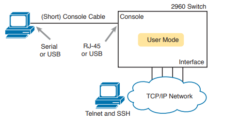
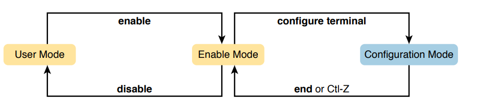
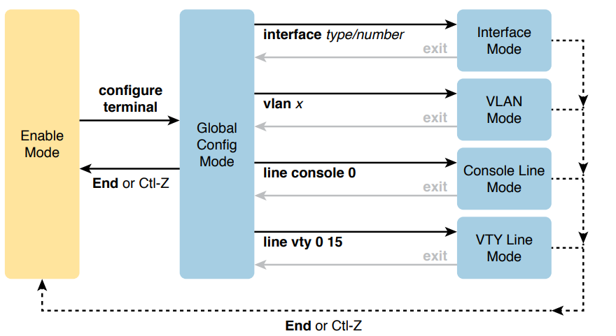
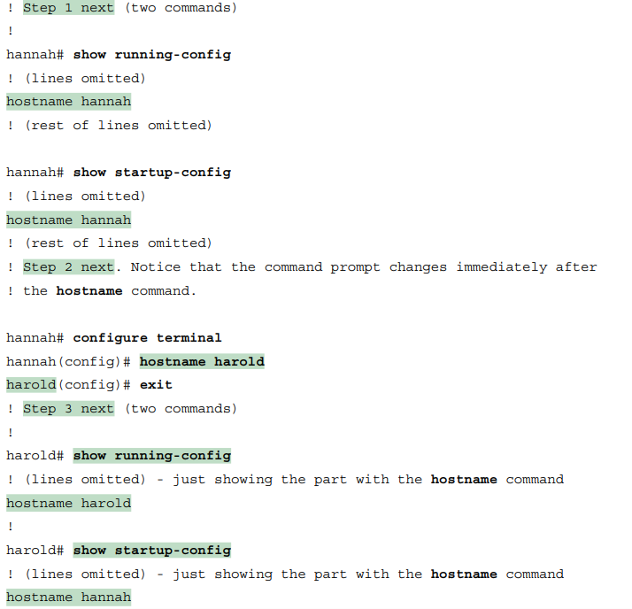

# CLI 初探

* [連線到 Cisco IOS CLI](#連線到-cisco-ios-cli)

* [CLI 層級：User Mode --> Privileged Mode --> Global Configuration Mode](#cli-層級user-mode----privileged-mode----global-configuration-mode)

* [Configuration submodes & Context](#configuration-submodes--context)
  * [小技巧：如何分辨哪些指令是 Global 還是 submodes？](#小技巧如何分辨哪些指令是-global-還是-submodes)

* [設定儲存在哪裡？ (Startup-config vs. Running-config)](#設定儲存在哪裡-startup-config-vs-running-config)

* [CLI 求助功能 (?)](#cli-求助功能-)

* [基本指令彙整](#基本指令彙整)

## 連線到 Cisco IOS CLI

可以透過三種方式連線到 Cisco IOS CLI：

* Console

* Telnet

* SSH


> Console 需要有 Console Cable 連接到 Console Port，Telnet 與 SSH 則需要網路連線。

## CLI 層級：User Mode --> Privileged Mode --> Global Configuration Mode

* **User Mode (>)**：只能查看系統資訊，無法修改設定。

* **Enable Mode (#)**：具備管理員權限，能夠執行權限較大的指令。

* **Global Configuration Mode (config)**：進入全域設定模式，只有此模式能修改設定。



## Configuration Submodes & Context

進入 Global Configuration Mode 後，可以進入不同的 submodes 進行不同的設定。

常見的 Mode 與 submodes：

| Prompt | Mode | 如何進入該 Mode |
| --- | --- | --- |
| hostname(config)# | Global | configure terminal |
| hostname(config-if)# | Interface | interface \<type> \<number> | 
| hostname(config-line)# | Line | line console 0 / line vty 0 4 |
| hostname(vlan)# | VLAN | vlan \<vlan-id> |



### 小技巧：如何分辨哪些指令是 Global 還是 submodes？

一般來說，一個設定如果是 switch/router 上獨一無二的，通常在 Global Configuration Mode 下設定；而一個設定如果是 switch/router 上有多個的，通常在 submodes 下設定。

舉例來說，hostname 是 switch/router 上獨一無二的，所以在 Global Configuration Mode 下設定；而 IP address 是 switch/router 上有多個的，所以在 Interface Configuration Mode 下設定。

另外，要做任何設定一定要在 Global Configuration Mode 下，Enable Mode 只是權限較大，但無法做任何設定(不過可以查看設定)。

## 設定儲存在哪裡？ (Startup-config vs. Running-config)

Cisco IOS 的設定分為兩種：

* **Startup-config**：開機/重新啟動後會自動載入的設定，儲存在 NVRAM 中。

* **Running-config**：目前正在使用的設定，儲存在 RAM 中。

當我們改變某項設定後，這個設定會被記錄在 Running-config 中，不過一旦關機或重啟該設定就會消失，原因是開機/重啟使用的是 Startup-config。

所以要讓設定保留下來，就必須將 Running-config 儲存到 Startup-config 中：

```bash
copy running-config startup-config
```

如果想要將 Startup-config 清除，以下三個指令都可以做到：

```bash
erase startup-config
write erase
erase nvram
```

如果要清除 Running-config，Cisco 並沒有相關的指令，不過清除 Startup-config 後再重新啟動就可以達到相同的效果：

```bash
erase startup-config
reload
```
> Cisco 的 reload 就等同於一般作業系統的 reboot，都是重啟的意思。

**範例**

Step 1. The example begins with both the running and startup-config having the same hostname, per the `hostname hannah` command.

Step 2. The hostname is changed in configuration mode using the `hostname harold` command.

Step 3. The `show running-config` and `show startup-config` commands show the fact that the hostnames are now different, with the `hostname harold` command found only in the running-config.



### CLI 求助功能 (?)

| 指令 | 功能 |
| --- | --- |
| ? | 列出當前模式下所有的可用指令 |
| command ? | 列出 command 第一個可能選項 |
| com? | 列出所有以 com 開頭的指令 |
| command parm? | 列出 command 所有以 parm 開頭的選項 |
| command parml ? | 列出「command parml」之後可用的選項 |

## 基本指令彙整

模式編號：

* User Mode：U
* Enable Mode：E
* Global Configuration Mode：G
* submodes：S
    * Interface Configuration Mode：S/I
    * Line Configuration Mode：S/L
    * VLAN Configuration Mode：S/V


| 指令 | 模式 | 功能 |
| --- | --- | --- |
| enable | U | 進入 Enable Mode |
| configure terminal (config t) | E | 進入 Global Configuration Mode |
| exit | ALL | 回到上一層模式 |
| end | G or S | 回到 Enable Mode |
| reload | E | 重新啟動裝置 |
| show running-config | E | 顯示 Running-config |
| show startup-config | E | 顯示 Startup-config |
| copy running-config startup-config | E | 將 Running-config 覆蓋掉 Startup-config |
| copy startup-config running-config | E | 將 Startup-config 覆蓋掉 Running-config |
| erase startup-config | E | 清除 Startup-config |
| erase nvram | E | 同上 |
| write erase | E | 同上 |
| hostname \<name> | G | 設定裝置名稱 |
| interface \<type> \<number> | G | 進入 Interface Configuration Mode |
| line console 0 | G | 進入 Line Configuration Mode |
| password cisco | S/L | 設定 Console Line 的密碼，密碼為 cisco |
| login | S/L | 啟用 Console Line 的登入功能(登入 Console 時需要密碼) |
| no login | S/L | 關閉 Console Line 的登入功能(登入 Console 時不需要密碼) |
| enable password cisco | G | 設定進入 Enable Mode 的密碼，密碼為 cisco |
| enable secret cisco | G | 設定進入 Enable Mode 的密碼，密碼為 cisco，並且加密 |
| no enable password | G | 清除進入 Enable Mode 的密碼 |
| no enable secret | G | 清除進入 Enable Mode 的加密密碼 |
| service password-encryption | G | 將所有密碼加密 |


