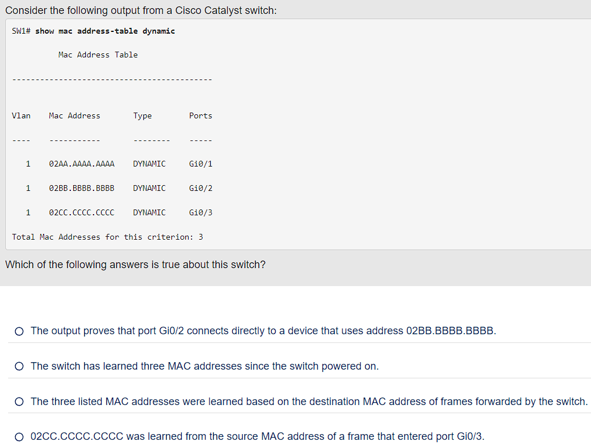
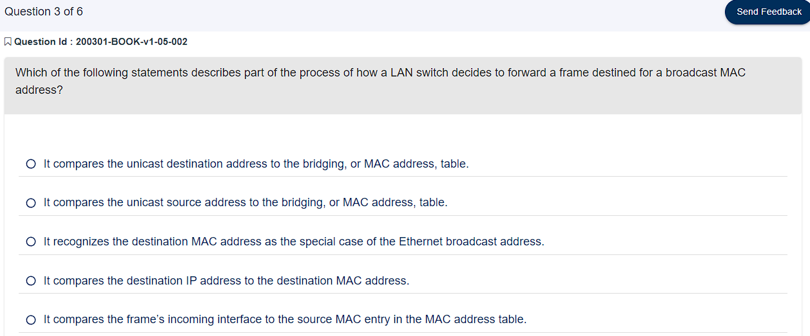
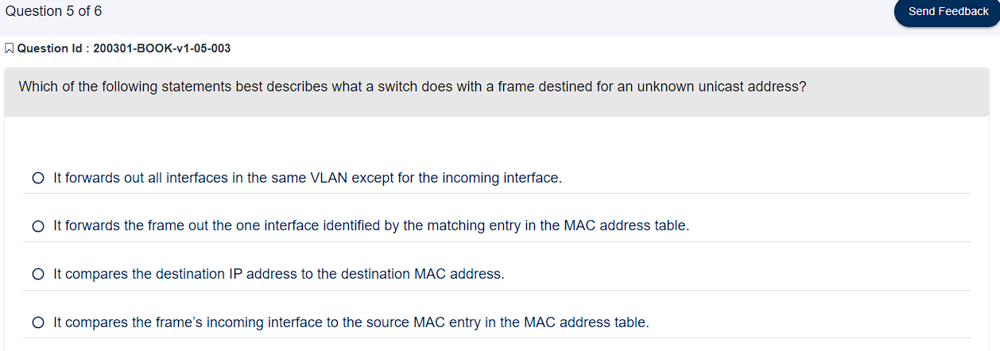

# 解析 LAN Switch 如何交換/傳送 Frame

## 目錄

* [基本交換邏輯](#基本交換邏輯)

* [Switch 如何學習 MAC Address](#switch-如何學習-mac-address)

* [目的 MAC 未知時：Flooding Unkown Unicast and Broadcast Frames](#目的-mac-未知時flooding-unkown-unicast-and-broadcast-frames)

* [目的 MAC Address 已知時：Forwarding Known Unicast Frames](#目的-mac-address-已知時forwarding-known-unicast-frames)

* [使用 STP (Spanning Tree Protocol) 避免 Broadcast 迴圈](#使用-stp-spanning-tree-protocol-避免-broadcast-迴圈)

* [總結：Switch 的交換邏輯](#總結switch-的交換邏輯)

* [用指令觀察 MAC table](#用指令觀察-mac-table)

## 基本交換邏輯

LAN Switch 在收到 frame 後，需要作出的主要決策是：「哪一個 Port 要來轉發這個 Frame，還是直接丟掉？」。

為了完成這個決策，Switch 需要做的事情以一下三點：

1. 根據目的 MAC Address 來決定何時轉送 frame 或丟棄。

2. Switch 透過學習 frame 的 Source MAC Address 來學習其他裝置的 MAC，以便未來轉送 frame 時能夠更快速。

3. 與其他 Switch 一起利用 Spanning Tree Protocol (STP) 來避免迴圈，確保唯一的 frame 副本會被傳送到目的地。

以上三點中，第一點是 Switch 最主要的功能，而關鍵點在於「MAC Address」。以下我們會介紹 Switch 如何學習 MAC Address、未知 MAC Address 時如何轉送 Frame、已知 MAC Address 時如何轉送 Frame。

### Switch 如何學習 MAC Address

Switch 使用 MAC Address Table 來紀錄 MAC Address 與 Port 的對應關係。當 Switch 收到一個 Frame 時，Switch 會檢查 Frame 的 Source MAC Address，並將「MAC Address」與「收到這個 Frame 的 Port」對應起來，並將這個對應關係寫入 MAC Address Table。

> 注意：MAC Address Table 也稱為 Switching Table 或  bridging table。Table 中的資料並非永久，每筆紀錄都會有 aging time，當超過 aging time 時，該筆紀錄就會被刪除。

在上圖中的流程很簡單：Fred 傳送 frame 給 Barney，然後 Barney 做出回應：

* 一開始 Switch 的 Table 是空的，當 Fred 傳送第一個 Frame (圖中的標示1) 給 Barney 時，該 Frame 從 F0/1 進入 Switch，因此 Switch 會將 Fred 的 MAC Address 與 F0/1 對應起來，紀錄到 MAC Address Table 中。

* 同理，Barney 重送 Frame 給 Fred 時 (圖中的標示2)，Switch 會將 Barney 的 MAC Address 與 F0/2 對應起來，紀錄到 MAC Address Table 中。

在這樣的學習過程中，Switch 會學到：

* 如果目的地為 Fred，則 Frame 應該送到 F0/1。

* 如果目的地為 Barney，則 Frame 應該送到 F0/2。

不過上面的流程似乎有一個漏洞：由於一開始 Switch 的 Table 是空的，當 Fred 的 frame 進入 Switch 時，Table 中也只有 Fred 的 MAC 與 Port 而已，並沒有任何關於 Barney 的資訊，那 Frame 要如何傳送給目的地 Barney？

底下我們來看看，在「目的 MAC Address 未知」的情況下，Switch 如何轉送 Frame。

### 目的 MAC 未知時：Flooding Unkown Unicast and Broadcast Frames

當 Switch 收到一個 Frame，若目的 MAC Address 在 Table 中找不到時，Switch 會將 Frame 複製成多個副本，轉送到**所有 Port**(除了來源 Port 以外)，這個動作稱為 **Broadcast**。(有時也稱為 **Flooding**)

> 這種未知的點對點傳送，Switch 並不知道 frame 的目的地，這種 frame 就稱為「Unknown Unicast Frame」，簡稱「Unknown Unicast」。

Broadcast 的邏輯其實很簡單：當你不知道目的地，那就傳送給所有人。當真正的目的地收到 Frame 時，通常會對來源端回應一個 Frame，這樣 Switch 就可以學習到目的地的 MAC Address，下次傳送時就可以直接將 Frame 轉送到正確的 Port，而不用再次 Broadcast。

另外，除了目的未知會被 Broadcast 之外，當一個 Frame 的目的地為「廣播地址」(FF-FF-FF-FF-FF-FF) 時，Switch 也會將 Frame Broadcast 出去，因為這個 Frame 的目標就是「所有人」。

### 目的 MAC Address 已知時：Forwarding Known Unicast Frames

當 Switch 收到一個 Frame，且目的 MAC Address 在 Table 中有紀錄時，Switch 會將 Frame 轉送到 Table 中對應的 Port，這就是所謂的 **Known Unicast**。

除了目的的 Port 之外，其餘的 Port 都不會轉發這個 Frame，這稱為「Filter」(過濾)。

> 這樣的的轉發決策被稱為「forward-versus-filter」。

先來看一個簡單的例子：

Fred 傳送一個目標地址為 0200.2222.2222 (Barney 的 MAC 地址) 的 frame。Switch 將目標 MAC 地址 (0200.2222.2222) 與 MAC 地址表進行比較，匹配到上圖「加粗的字體項目」。該匹配的表項告訴 Switch 將 frame 轉發到 F0/2 埠，且僅轉發到 F0/2 埠(F0/3 & F0/4 會 filter 掉)。

再來看一個稍微複雜的例子：Fred 傳送 Frame 給 Wilma，途中經過兩個 Switch。

### 使用 STP (Spanning Tree Protocol) 避免 Broadcast 迴圈

現在回頭來看 Unknown Unicast 的情況。

雖然 Broadcast 解決了目的 MAC 未知的狀況，但卻可能會造成 Frame 在多個 Switch 之間無限迴圈，例如下圖：

在上圖中，沒有任何 Switch 知道 Bob 的 MAC Address，因此 Frame 會被無限的 Broadcast 到不同的 Switch(因為每台 Switch 都不知道目的地)，因此造成無限迴圈。

而解決這個問題的方法就是使用 Spanning Tree Protocol (STP)。

現階段只需要知道「STP 可以解決迴圈」，而如何設定 STP 將會在 CH 9 中提到。

### 總結：Switch 的交換邏輯

**Step 1**. Switch 根據目的 MAC Address 來轉發 frame：

* 如果目的 MAC Address 是 broadcast、 multicast 或 unknown unicast，Switch 會將 frame Flooding。

* 如果目的 MAC Address 是已知的單播地址 (MAC table 中找到的單播地址)：

  * 情況 1：MAC Address Table 中列出的 outgoing interface 與接收到 frame 的 interface 不同，Switch 會將 frame 轉發到 outgoing interface。

  * 情況 2：outgoing interface 與接收到 frame 的 interface 相同，Switch 會過濾 (filter) 該 frame，意味著 Switch 會忽略該 frame 而不轉發。

**Step 2**. Switch 使用以下邏輯來學習 MAC Address Table 條目：

  * 對於每個接收到的 frame，檢查 **Source** MAC Address 並記錄接收到 frame 的 interface。
  
  * 如果 MAC Address 不在 Table 中，則將 MAC Address 和學習到的 interface 添加到 Table 中。

**Step 3**. Switch 使用 STP 來防止迴圈，通過使某些接口阻塞 (block)，意味著它們不會發送或接收 frame。

### 用指令觀察 MAC table

Cisco 的 Switch 在出廠時，有一些預設的設定：

* Interface 預設打開，Switch 接上 cable 後就可以立即使用。

* 所有 Interfaces 預設屬於 VLAN 1。

* 10/100 & 10/100/1000 預設啟用「自動協商(autonegotiation)」。

* STP 預設啟用。

底下列出常用的使用來觀察 Switch 的相關設定。

> 模式編號：

* User Mode：U
* Enable Mode：E
* Global Configuration Mode：G
* submodes：S
    * Interface Configuration Mode：S/I
    * Line Configuration Mode：S/L
    * VLAN Configuration Mode：S/V

| 指令 | 模式 | 說明 |
| --- | --- | --- |
|show mac address-table | E | 顯示已知的靜態 MAC Address Table |
|show mac address-table dynamic | E | 顯示動態學習到的 MAC Address Table |
|show interfaces status | E | 顯示所有 Interface (Port) 的狀態 |

補充：在 Router 上列出 routing table 的指令是 `show ip route`。

## 問答題

  
答案

Ans：1

> Explanation：A switch compares the destination MAC address to the MAC address table. If a matching entry is found, the switch forwards the frame out the appropriate interface. If no matching entry is found, the switch floods the frame.

  
答案

Ans：4

> Explanation：For the correct answer, each entry lists the learned MAC address. By definition, dynamically learned MAC addresses are learned by looking at the source MAC address of received frames. (That fact rules out one of the incorrect answers as well.) The show mac address-table dynamic command lists the current list of MAC table entries, with three known entries at the point at which the command output was gathered. The counter in the last line of output lists the number of current entries, not the total number of learned MAC addresses since the last reboot. For instance, the switch could have learned other MAC addresses whose entries timed out from the MAC address table. Finally, the answer that claims that port Gi0/2 connects directly to a device with a particular MAC address may or may not be true. That port could connect to another switch, and another, and so on, with one of those switches connecting to the device that uses the listed MAC address.

  
答案

Ans：3

> Explanation：A switch floods broadcast frames, multicast frames (if no multicast optimizations are enabled), and unknown unicast destination frames (frames whose destination MAC address is not in the MAC address table).

  
答案

Ans：3

> Explanation：The show interfaces status command lists one line of output per interface. Cisco Catalyst switches name the type of interface based on the fastest speed of the interface, so 10/100 interfaces would be Fast Ethernet. With a working connection, ports from FastEthernet 0/1 through 0/10 would be listed in a connected state, while the rest would be listed in a notconnected state.

  
答案

Ans： 1

> Explanation：A switch floods broadcast frames, multicast frames (if no multicast optimizations are enabled), and unknown unicast destination frames (frames whose destination MAC address is not in the MAC address table).

  
答案

Ans：2

> Switches need to learn the location of each MAC address used in the LAN relative to that local switch. When a switch receives a frame, the source MAC identifies the sender. The interface in which the frame arrives identifies the local switch interface closest to that node in the LAN topology.