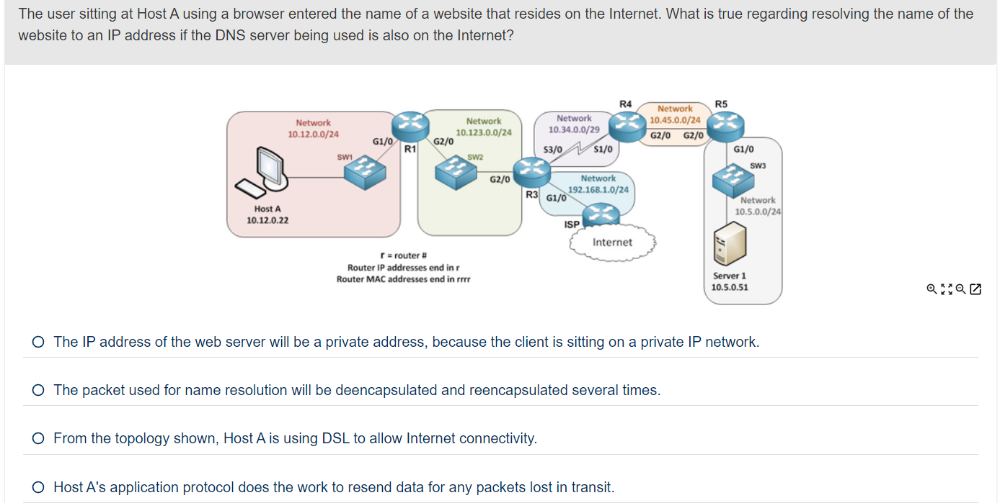

# Part 1 review questions

  
答案

Ans：1、3

> Explanation：Routers and other devices need to know the Layer 2 addresses of other devices on the same local network they want to communicate with. R5 needs the Layer 2 address of R4 to encapsulate and forward frames to R4. Leased lines, provided by service providers, often use serial interfaces to connect to the customers’ routers, similar to what is shown between R3 and R4. Between R2 and R3, only a LAN switch icon exists, so this equipment is most likely owned by the enterprise with no need to use a service provider's network.Routing protocols can be used for routers to learn and advertise routes with each other.Note finally, for the answer suggesting the PC1 needs to know the MAC address of server 1, it does not. Hosts need to know the MAC address of other hosts and routers in the same subnet, but not the MAC addresses of devices in other subnets.

  
答案

Ans：2

> Explanation：10BASE-T and 100BASE-T use two pairs of wires in a UTP cable, one to transmit in each direction. For a PC or Router, the pair at pins 1 and 2 are for transmission while the pair at pins 3 and 6 are used for receiving. On a Switch, the reverse is true: the pair at pins 1 and 2 are for receiving while the pair at pins 3 and 6 are used for transmission.

  
答案

Ans：2、3

> Explanation：10BASE-T and 100BASE-T use two pair, with the pair at pins 1,2 needing to be crossed to pins 3,6 to create a crossover cable. Those facts support one of the correct answers. Similarly, a 1000BASE-T crossover cable swaps the pair at pins 1,2 with the pair at pins 3,6. However, Gigabit Ethernet uses four pair, with the crossover cable requiring the swapping of the pair at pins 4,5 with the pair at pins 7,8. The figure shows all four pair swapped, showing the correct 1000BASE-T crossover cable pinout.The pinouts do not show a straight-through pinout, which would connect pin 1 to pin 1, pin 2 to pin 2, and so on.

  
答案

Ans：1、3

> Explanation：Web browsers and servers use HTTP, and in turn HTTP uses TCP, not UDP (making one answer correct and one answer incorrect.)For the forwarding logic, note that the router will compare the packet's destination IP address to its routing table. Two answers mention packets going to the web server, so those packets would list the web server's address as the destination address, making one of those answers correct, and one incorrect.

  
答案

Ans：2

> Explanation：When traffic is sent over an IP network, assuming NAT is not used, the source and destination IP addresses are not changed. Because of this, the source address would be host A’s IP address 5.5.5.100.

  
答案

Ans：2

> Explanation：Because Host A is several networks away from the Internet, where the DNS server is, each router in the path will deencapsulate and then reencapsulate the DNS request each time it forwards it along the path. DNS server information can be dynamically configured on hosts (such as Host A) via the Dynamic Host Configuration Protocol (DHCP).If the server being resolved (name resolution) is a public server on the Internet, it will have a reachable public IPv4 address, and not a private address. The topology shows Gigabit Ethernet connectivity with switches and routers only, with no indication of DSL technology in use for Internet connectivity. Finally, note that the question states that the host connects to a web server, meaning that HTTP (or HTTPS) is used as the application layer protocol. Those protocols do not perform error recovery, instead relying on TCP as the transport layer protocol - a protocol that does do error recovery.

  
答案

Ans：2、5

> Explanation:Links between PCs, switches, and between a PC and switch can use either full or half duplex for links at speeds of 1Gbps and slower. In contrast, note that any links connected to hubs must use half duplex because the hub requires the use of half duplex and CSMA/CD. Of course, when both devices on the ends of the link support full duplex, full duplex is preferred, but not required.

  
答案

Ans：4

> Explanation:The cable between a hub and a switch would need to be a crossover cable in order to work. However, from the scenario, you know that the PC was working when connected directly to the switch port. That fact, along with the fact that the switch is not using auto-MDIX, means that the cable pinout of the cable from the switch to the PC is a straight-through cable. As a result, once the hub connects to the port, the hub will not be able to communicate with the switch, and the user PC will not have any access to the corporate network through the switch. Alternately, if the user had either (a) used a crossover patch cable, or (b) enabled auto-MDIX, then the hub would be able to communicate with the switch. At that point, the link would work at half duplex, and the throughput for the user might be reduced.

  
答案

Ans：3

> Explanation：End devices like Host A use a straight-through cable to connect to a switch. (A router would also use a straight-through cable to connect to a switch). Every device, when forwarding traffic over an Ethernet-type connection will encapsulate and include in the frame the Layer 2 MAC address of the next device in the path. If the Layer 2 address isn’t known, IPv4 protocol will use ARP (Address Resolution Protocol) to request and learn it.Host A doesn’t need to learn any Layer 2 MAC addresses for devices in remote IP networks. Host A would need to know the MAC address of its default gateway (R1) and could use ARP to learn the local router’s MAC address if not already in the ARP cache on Host A. With the labeling in the topology, all the Ethernet is running at Gigabit speed. The serial connection, which is a leased line, is usually much slower than the high-speed Ethernet. If there is a network slow point regarding bandwidth, it would be the serial link between R3 and R4.

  
答案

Ans：1、4

> Explanation:Ethernet requires crossover cables between devices that use the same UTPpinouts - for instance, links between pairs of PCs, pairs of routers, and pairs of switches. (Hubs act like switches in terms of Ethernet cabling.) PCs, routers, and wireless APs use the same Ethernet pinouts, opposite from switches.Ethernet requires straight-through cables between devices that use opposite pinouts - for instance, for links between a PC and switch or between a router and switch.
